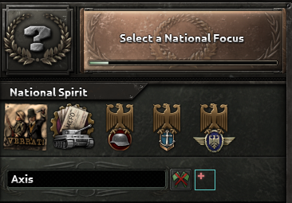
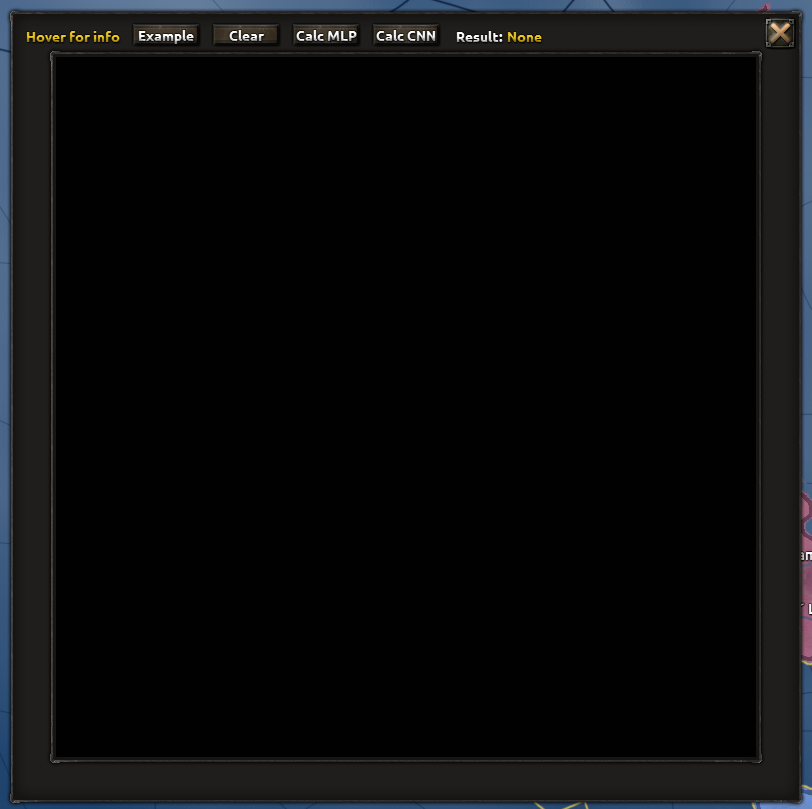

# ho-ieee-754

The goal of this mod is to provide an implementation floating-point numbers, according to the IEEE 754 standard, to the Hearts of Iron IV modding system, for use by other modders.

This mod has been released with the capability to do all four basic operations (+, -, *, /) and comparisons. I am pretty busy due to school, but if I have extra time I will try to make some of the easier functions. This mod has been updated to 1.17, and it also works on 1.16.

If you want to use this mod for floating point maths in your own program, I would recommend adding this mod as a dependency, as it makes updates easier. Do note that this implementation is not particularly performant, so preferably don't do thousands of multiplications an in-game day. Printing in GUIs is doable by creating a scripted loc and setting the print temp-variables inside the trigger (see the scripted GUI for an example).

# Why?

In 1.16, HOI4's modding script uses signed 32-bit fixed-point variables(referred to later as pdxvars), ranging from -2,147,483.648 to 2,147,483.647, with accuracy to the thousandth-place. This means that variables can overflow, losing the true value, or can be truncated, losing precision. So, I am working on an implementation of floating-point variables according to the IEEE 754 standard, which would allow for both a greater range of numbers and a greater precision, while maintaining a modder-friendly interface within Paradox's provided modding script. Currently, this project is a work-in-progress, and likely will be for the near future as there is still much to do. As of the 1.17 update, the way the script manipulates variables is not wholly known, but it it still limited to a fixed range of magnitudes.

# Key Functions
Below is a chart of the scripts I found most interesting, where to find them, and what they do. I have omitted the "_trigger" ending for some of their names, as that has no impact on their actual function:
| Script | Located In | Function |
| :--- | :--- | :--- |
| hnn_run_cnn | [common/scripted_effects/hnn.txt](common/scripted_effects/hnn.txt#L1140) | Runs a convolutional model on the input given in the input GUI |
| hnn_run_mlp | [common/scripted_effects/hnn.txt](common/scripted_effects/hnn.txt#L879) | Runs a multi-layer perceptron model on the input given in the input GUI - not accurate, this was the first model implemented, but it works on the example |
| ieeeDiv | [common/scripted_triggers/ieee_operations.txt](common/scripted_triggers/ieee_operations.txt#L592) | Performs floating point division between two given arguments |
| ieeeMul | [common/scripted_triggers/ieee_operations.txt](common/scripted_triggers/ieee_operations.txt#L373) | Performs floating point multiplication between two given arguments |
| ieeeAdd | [common/scripted_triggers/ieee_operations.txt](common/scripted_triggers/ieee_operations.txt#L11) | Performs floating point addition between two given arguments |

# HNN(Hematite Neural Networks)
## Why
This branch exists to provide a more robust demonstration of both the capabilities and limitations of the ho-ieee-754 implementation. This branch gives an example of a mod using ho-ieee floating point numbers by implementing two neural networks, one a multi-layer perceptron(MLP) and the other a convolutional neural network(CNN), in order to classify digits in the [MNIST](https://en.wikipedia.org/wiki/MNIST_database) format. A GUI is provided for the user to input a new digit graphically, which then can be fed into models which are implemented in-game.
## Usage
The HNN input GUI can be accessed through the GER tag. Click the wireframe blue button next to the faction disband button. This tab is accessible by clicking the national flag in the top left.

From there a new GUI will pop up. This GUI features 2 main parts - the top bar where actions are performed, and a 28x28 input board where the digit is visualized and drawn. You are able to draw digits by clicking the board, with multiplier keys to change the board more efficiently.
Along the top bar there are a series of features. From left to right these are:
- Hoverable that displays information about how to manipulate the input board
- Button to load an example digit(a five) from the actual MNIST dataset
- Button to reset the board to a completely blank state
- Button to predict the digit using an MLP model
    - Note, this model takes a while to execute
    - Also note, this model is very inaccurate as an MLP is not a good model architecture for computer vision
- Button to predict the digit using a CNN model
    - Note, this model takes a very long time to execute, upwards of a minute on my device
- Result display, showing the resultant digit from the model's prediction
- Close button, which closes the GUI(it is reopenable from the button described above)

## Implementation
The two models were first trained using [Keras](https://keras.io). From the models, I exported the weights and biases, transformed them into their ho-ieee equivalents, and plugged them into on_actions that load the model on game startup (see the [first](common/on_actions/hnn_init.txt) and [second](common/on_actions/hnn_init2.txt) on_action files for for the MLP and CNN networks constants respectively). From these constants, the model is implemented in a [scripted effect file](common/scripted_effects/hnn.txt#L1140) alongside a GUI that allows the user to draw and execute the models. The models perform similarly to the actual models trained using Keras. However, the greatest drawback is the calculation time. Since tens of thousands of operations need to be executed for the model to perform one classification, the wait times are significant for both the MLP and especially the CNN, the latter of which potentially taking upwards of a minute. If I have more time, I might look to improve the multiplcation operation, perhaps by implementing [Karatsuba's](https://en.wikipedia.org/wiki/Karatsuba_algorithm).

Below this will be the rest of ho-ieee-754's README.

# Background

From [Wikipedia](https://en.wikipedia.org/wiki/IEEE_754):
> The IEEE Standard for Floating-Point Arithmetic (IEEE 754) is a technical standard for floating-point arithmetic established in 1985 by the Institute of Electrical and Electronics Engineers (IEEE).

This standard allows for the storage of real numbers of both extremely large and extremely small magnitudes(10±38 in the single-precision format used here) while maintaining relatively good precision(around 10-7 proportionally). You can read the entire standard in this repo at `extras/IEEE_754.pdf`.

The plan is to use Hearts of Iron IV's built-in modding script to provide as complete of an implementation of the IEEE 754 standard as possible, using the pdxvars themselves to store the data of floating-point variables. Since pdxvars are basically 32-bit signed integers that are divided by 1000, the same 32 bits of data can be used to store a single-precision floating-point variable according to the IEEE standard. This means that while the math behind the scenes will be floating point, the variables will be able to be stored as usual in pdxvars, only being converted in the scripts that perform calculations. 

# Goals

This mod is designed to be used in combination with other mods.  
This means that:
1. This mod works within the modding framework that Hearts of Iron IV provides, so scripted effects, scripted triggers, scripted localisation, duct tape, and the like.
2. The mod provides a method of interfacing with itself with other mods. The ultimate goal will be a set of files, which can be added to any other mod, that provide a system of creating, interacting with, accessing, and outputting floating-point variables.

# Next Steps

- [x] Creation and Destruction of floating-point variables (FPVs)
- [x] FPV Output
- [x] Comparison
- [x] Addition and Subtraction
- [x] Multiplication
- [x] Division
- [ ] Write simple functions (abs, copySign, logB, etc.)
- [ ] Fused Multiply-Add
- [ ] Square Root (unlikely)

## Probably out of scope
- [ ] Complete adherence to IEEE 754 standard
- [ ] Recommended operations (consult Clause 9 of IEEE 754)

For completeness, a chart describing all the functions outlined by IEEE 754 can be found at `extras/progress.md`.

# Who?

This project is currently maintained by one modder, FunkyDe.
